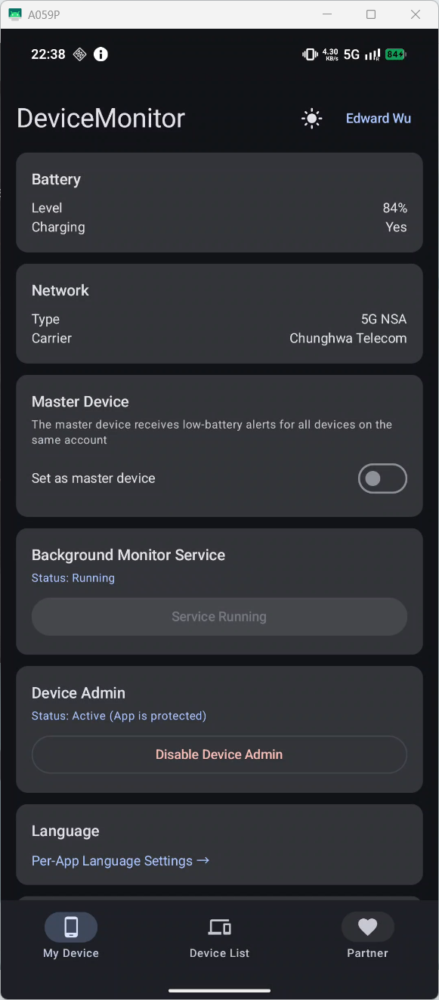
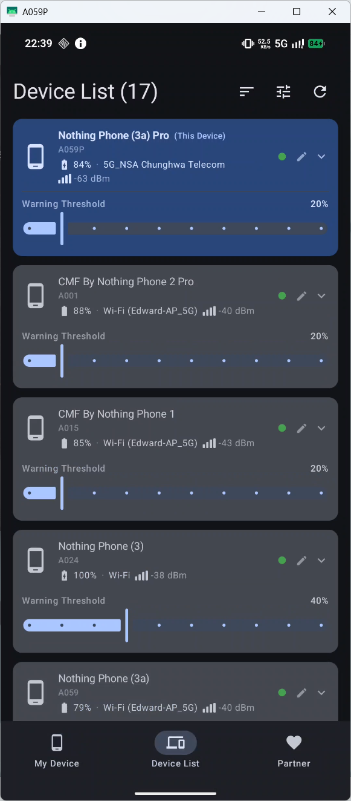
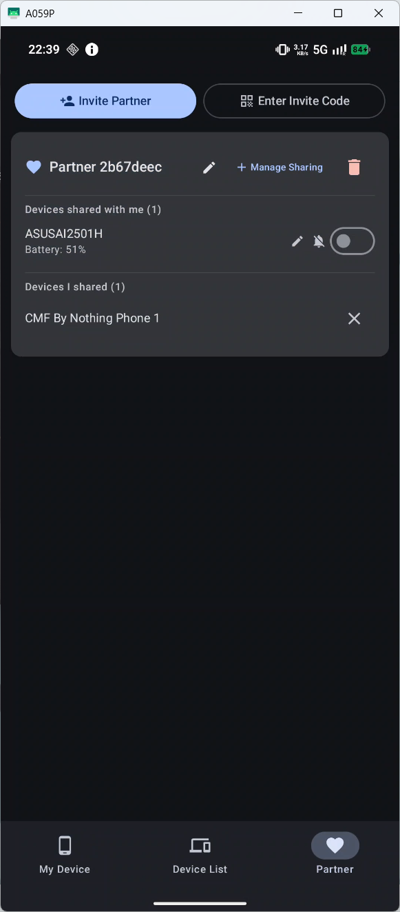

# Device Monitor

> [繁體中文](README_zhTW.md) | [简体中文](README_zhCN.md) | **English** | [Architecture & Dev Guide](ARCHITECTURE.md)

Monitor battery level and network status across multiple Android devices in real time. Automatically notifies the designated master device when battery drops below a configurable threshold.  
No self-hosted server required — just sign in with a Google account and start monitoring.

---

## Index

- [Screenshots](#screenshots)
- [Features](#features)
- [Requirements](#requirements)
- [Installation](#installation)
- [Setting the Master Device](#setting-the-master-device)
- [Device List Operations](#device-list-operations)
- [Partner Mode](#partner-mode)
- [Recommended Settings](#recommended-settings-for-better-background-survival)
- [Tech Stack](#tech-stack)
- [Privacy](#privacy)
- [For Maintainers](#for-maintainers)

---

## Screenshots

| My Device | Monitor List | Partner Mode |
|---|---|---|
|  |  |  |

---

## Features

### Monitoring & Display

- Real-time display of battery level, charging state, and network type (Wi-Fi / 4G / LTE / 5G NSA / 5G SA) for all devices
- Wi-Fi shows SSID; mobile network shows carrier name and signal strength (bars + dBm)
- **Battery history chart**: the last 5 battery readings are displayed as a mini trend chart on each device card (toggle visibility via display settings)
- **Home screen widget**: a Jetpack Glance widget shows key device stats directly on your launcher
- **Realtime connection status**: a banner appears when the WebSocket connection drops and disappears automatically on reconnect
- **Sort order**: tap the sort button to cycle between name (default), battery ascending, battery descending, and offline-first (stale or offline devices float to the top)
- **Display settings** (Tune button in the header): toggle the visibility of warning threshold sliders, critical threshold sliders, and the battery history chart on device cards; also the entry point for inviting a new partner

### Alerts & Notifications

- Low-battery alerts: the master device receives a local notification when a device drops below the warning threshold (silenced while charging; fires immediately once charging stops if still below threshold)
- **Two-tier alert thresholds**: each device has an independent warning threshold (adjustable in 10% steps, 10–100%) and critical threshold (default: half the warning threshold, min 10%), shown with distinct red styling
- **Full-charge notification**: a notification fires when a device reaches 100%
- **Offline notification**: a notification fires when a device stops reporting for more than 3 minutes
- **FCM push notifications**: Firebase Cloud Messaging delivers alerts even when the app is in the background or closed
- Master device setting: designate one device to receive all alerts (only one per account)
- **Quiet hours**: configure a time window during which all notifications are silenced
- Device alias: set a custom display name for each device (also used in alert notifications)

### Device List

- **Pinned devices**: your own device is always at the top; swipe right on any card to pin it; pinned devices support long-press drag-to-reorder
- **Delete device**: enable delete mode in settings to reveal a delete button on each card (swipe right); supports multi-select — tap cards to select, then tap the header button to batch-delete; delete mode auto-disables 60 seconds after the last deletion
- **Batch alert threshold**: with multiple cards selected in delete mode, set the warning threshold for all selected devices at once
- Pull-to-refresh: swipe down to force-reload all device data

### Partner Mode

- Share device monitoring across different Google accounts — generate an 8-character invite code (with QR code); invite codes expire after 30 minutes (countdown shown)
- Manage which devices are shared per partner; set custom display names for partners and aliases for their devices (aliases are also used in low-battery notifications)
- **Share directly from the monitor list**: swipe right on any device card to reveal a share button and toggle sharing per partner without leaving the list
- Each partner independently controls whether they receive low-battery alerts for each shared device
- **Partner share notification**: receive a notification when a partner shares a new device with you
- **Offline cache**: partner device cards remain visible with last-known state even when the WebSocket is temporarily disconnected
- Up to 5 partners per account

### Reliability

- Continuous background monitoring — uploads device status even when the screen is off
- **Exponential backoff**: failed upserts are automatically retried with increasing delays to handle transient network errors
- **In-app update**: automatically checks for new versions on launch; download and install the APK without leaving the app
- **Beta update channel**: opt in to receive beta releases (tagged with `-beta`) instead of stable-only updates

---

## Requirements

- Android 10 (API 29) or higher
- Google account
- "Install unknown apps" permission enabled (for sideloading the APK)

---

## Installation

1. Download the latest `app-release.apk`
2. Open the APK on your phone and install it
3. Launch the app → tap **Sign in with Google**
4. After signing in, tap **Start Monitor Service**

Repeat on every device you want to monitor, signing in with the **same Google account**.

---

## Setting the Master Device

The device that should receive low-battery alerts must be set as the master device:

1. Open the app → **My Device** tab
2. Enable the **Master Device** toggle

Only one master device is allowed per account.

---

## Device List Operations

| Action | Description |
|---|---|
| Swipe right on a card | Reveal the pin, share, and (if delete mode is on) delete buttons |
| Long-press the drag handle on a pinned card | Drag vertically to reorder pinned devices |
| Tap a card | Expand / collapse device details (or toggle selection in delete mode) |
| Tap the pencil icon | Set a device alias |
| Tap "Delete (N)" in the header | Batch-delete all selected devices (visible when delete mode is on and at least one card is selected) |
| Tap the sort icon in the header | Cycle through sort orders: name / battery ↑ / battery ↓ / offline-first |
| Tap the Tune icon in the header | Open display settings: toggle threshold sliders and battery history chart; invite a new partner |
| Pull down on the list | Force-refresh all device data |

Your own device is always fixed at the very top of the list and cannot be displaced.

---

## Partner Mode

Partner mode lets two users on **different Google accounts** monitor each other's devices.

### Adding a partner

1. Open the **Partner** tab → tap **Invite Partner**
2. Select the devices to share (a select-all option is available), then tap **Generate Invite Code**
3. Share the 8-character code or QR code with the other user
4. The other user opens the **Partner** tab → tap **Enter Invite Code** → type the code manually or tap the QR icon to scan it
5. Pairing is complete — both users can now see each other's shared devices

### Managing shared devices

- **Share from the monitor list**: swipe right on any device card to reveal a share button; toggle sharing per partner without leaving the list
- **Add more devices later**: on the Partner tab, tap **Manage Sharing** on a partner card; select additional devices to share (select-all available)
- **Remove a shared device**: tap × on any device in the "Shared by me" section of the partner card

### Naming and notifications

- **Rename a partner**: tap the pencil icon in the partner card header to set a custom display name
- **Set a device alias**: tap the pencil icon next to any shared device to give it a custom name; the alias is also used in low-battery notifications
- Each partner independently controls whether they receive low-battery alerts for each shared device via a per-device toggle

Up to 5 partners per account.

---

## Recommended Settings (for better background survival)

Go to **Settings → Apps → Device Monitor** on each phone and apply:

| Setting | Recommended value |
|---|---|
| Battery optimization | Unrestricted |
| Background activity | Allow |
| Device admin | Enable (prevents accidental uninstall) |

---

## Tech Stack

| Item | Technology |
|---|---|
| Language | Kotlin |
| UI | Jetpack Compose |
| Backend | Supabase (Postgres + Realtime + Auth) |
| Authentication | Google Sign-In → Supabase Google OAuth |
| Background keep-alive | Foreground Service + WorkManager + AlarmManager |
| Local storage | SharedPreferences (replaces Room; no KSP required) |
| Pin ordering | SharedPreferences (PinnedOrderManager) |
| Min SDK | API 29 (Android 10) |

---

## Privacy

- All device data is stored in Supabase and isolated by Google account UID
- Data from different accounts is completely separate and mutually inaccessible
- No personally identifiable information beyond what is required for authentication is collected

---

## For Maintainers

### Force Re-signin Flag

**File:** `app/src/main/java/tw/bluehomewu/devicemonitor/AppConfig.kt`

```kotlin
object AppConfig {
    const val FORCE_RESIGN_FROM_VERSION: String? = "1.13.0"
}
```

Setting `FORCE_RESIGN_FROM_VERSION` to a version string forces all existing users to sign out and re-authenticate the next time they launch the app. A toast message is shown explaining why.

**When to use:** after a backend migration (e.g. switching to a self-hosted Supabase instance), an auth schema change, or any other event that invalidates existing sessions.

**How to trigger re-signin in the next release:**

1. Open `AppConfig.kt`
2. Set `FORCE_RESIGN_FROM_VERSION` to the new version string (e.g. `"1.14.0"`)
3. Ship the release

**Behaviour:**
- Users with an existing session are signed out automatically on first launch; a toast appears: *"版本更新後需重新登入，請重新登入"*
- Users on a fresh install are **not** affected (no session to clear)
- Once the user signs back in, the version is recorded in SharedPreferences (`force_resign_done_for`); subsequent launches are unaffected
- Setting the constant back to `null` disables the feature entirely

**To trigger again in a future version:** change the value to that version's string (e.g. `"1.15.0"`). Any user whose stored value differs from the new string will be forced to re-signin once more.
