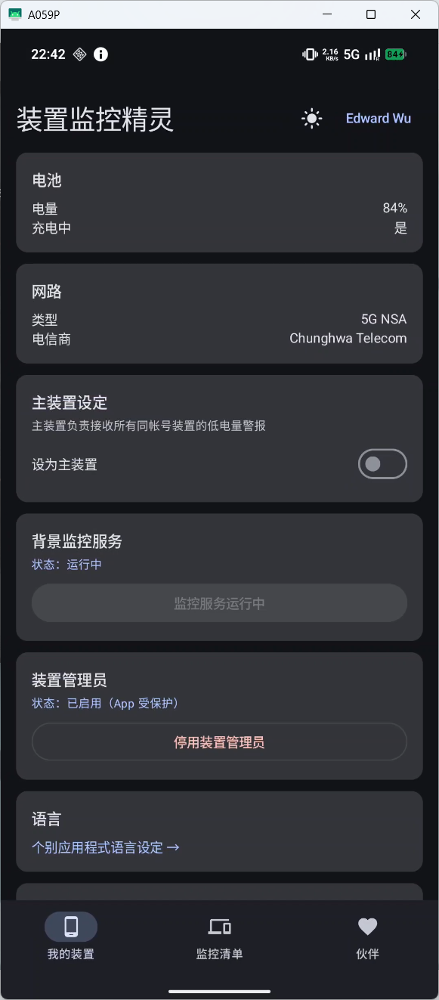
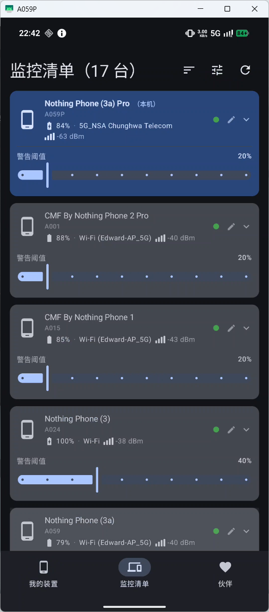
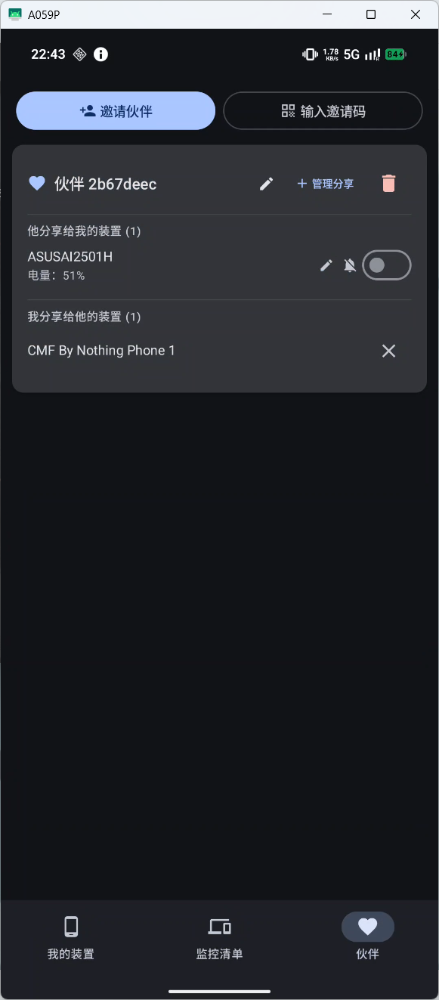

# 设备监控精灵（Device Monitor）

> [繁體中文](README_zhTW.md) | **简体中文** | [English](README.md) | [架构与开发说明](ARCHITECTURE.md)

实时监控多台 Android 手机的电量与网络状态，并在电量低于阈值时自动通知主设备。  
无需自建应用后端，使用 Google 账号登录即可开始监控。

---

## 目录

- [截图](#截图)
- [功能](#功能)
- [安装需求](#安装需求)
- [安装步骤](#安装步骤)
- [设置主设备](#设置主设备)
- [监控列表操作](#监控列表操作)
- [伙伴模式](#伙伴模式)
- [建议设置](#建议设置提升后台存活率)
- [技术架构](#技术架构)
- [隐私说明](#隐私说明)
- [维护者备忘](#维护者备忘)

---

## 截图

| 我的设备 | 监控列表 | 伙伴模式 |
|---|---|---|
|  |  |  |

---

## 功能

### 监控与显示

- 实时显示所有设备的电量、充电状态、网络类型（Wi-Fi / 4G / LTE / 5G NSA / 5G SA）
- Wi-Fi 显示 SSID，移动网络显示运营商名称与信号强度（格数 + dBm）
- **电量历史图**：每张设备卡片显示最近 5 笔电量趋势图，可在列表设置中开关
- **桌面 Widget**：使用 Jetpack Glance 制作桌面小组件，可直接在桌面查看设备状态
- **Realtime 连接状态**：WebSocket 断线时显示提示横幅，重连后自动消失
- **排序方式**：点击排序按钮切换名称、电量升序、电量降序、离线优先
- **列表显示设置**：可开关警告阈值滑杆、紧急阈值滑杆、电量历史图，也是邀请伙伴的入口

### 警报与通知

- 低电量警报：电量低于警告阈值时，主设备收到本地通知；充电中静音，拔除充电后若仍低电量会立即补发
- **双层警报阈值**：每台设备可独立设置警告阈值与紧急阈值
- **充满电通知**：设备充到 100% 时发送通知
- **设备离线通知**：设备超过 3 分钟未回报时发送通知
- **FCM 推送通知**：通过 Firebase Cloud Messaging，在应用处于后台或已关闭时仍可收到警报
- 主设备设置：指定一台设备接收所有警报，同一账号只能有一台主设备
- **免打扰时段**：在指定时间段内自动静音通知
- 设备别名：为每台设备设置自定义显示名称，通知也会使用别名

### 监控列表

- **置顶设备**：本机永远排第一；右滑其他设备卡片可置顶，置顶设备支持长按拖拽排序
- **删除设备**：在设置中开启删除模式后，右滑卡片会显示删除按钮；支持多选批量删除
- **批量设置警报阈值**：在删除模式下选取多台设备，可一次设置所有被选设备的警告阈值
- 下拉刷新：向下滑动即可强制重新加载所有设备数据

### 伙伴模式

- 跨账号共享设备监控：生成 8 位邀请码（附 QR Code），邀请码有效期 30 分钟
- 可对每位伙伴分别管理要分享的设备，并设置伙伴显示名称与设备别名
- **从监控列表直接分享**：右滑设备卡片即可对每位伙伴切换分享状态
- 每位伙伴可独立设置是否接收对方各设备的低电量警报
- **伙伴分享通知**：伙伴分享新设备给你时发送通知
- **离线缓存**：WebSocket 短暂断线时，伙伴设备仍显示最后已知状态
- 每个账号最多 5 位伙伴

### 稳定性

- 后台持续监控，即使屏幕关闭也能继续上传状态
- **指数退避重试**：upsert 失败时自动以递增间隔重试，应对短暂网络错误
- **应用内更新**：启动时自动检查新版本，可直接下载并安装 APK
- **Beta 更新频道**：可在设置中开启，追踪带有 `-beta` 字样的测试版

---

## 安装需求

- Android 10（API 29）或更高版本
- Google 账号
- 允许“安装未知来源应用”（用于侧载 APK）

---

## 安装步骤

1. 下载最新的 `app-release.apk`
2. 在手机上打开 APK 并安装
3. 启动应用，点击“通过 Google 登录”
4. 登录后点击“启动监控服务”

每台需要监控的手机都重复以上步骤，并使用**同一个 Google 账号**登录。

---

## 设置主设备

接收低电量警报的手机需要设置为主设备：

1. 打开应用，进入“我的设备”页签
2. 开启“主设备”开关

同一账号下只能有一台主设备。

---

## 监控列表操作

| 操作 | 说明 |
|---|---|
| 右滑设备卡片 | 显示图钉、分享按钮；开启删除模式时同时显示删除按钮 |
| 长按置顶设备的拖拽把手 | 垂直拖动调整置顶顺序 |
| 点击卡片 | 展开 / 收合详细信息；删除模式下改为切换选取状态 |
| 点击铅笔图标 | 设置设备别名 |
| 点击 Header 的“删除（N）”按钮 | 批量删除所有选取设备 |
| 点击 Header 的排序图标 | 切换名称 / 电量升序 / 电量降序 / 离线优先 |
| 点击 Header 的 Tune 图标 | 打开列表显示设置，并可邀请新伙伴 |
| 下拉列表 | 强制刷新所有设备数据 |

本机设备永远固定在列表最上方，无法被其他设备超过。

---

## 伙伴模式

伙伴模式允许两个使用**不同 Google 账号**的用户互相监控对方共享的设备。

### 新增伙伴

1. 打开**伙伴**页签，点击“邀请伙伴”
2. 选择要分享的设备，可一键全选，然后点击“生成邀请码”
3. 将 8 位邀请码或 QR Code 分享给对方
4. 对方打开**伙伴**页签，点击“输入邀请码”，手动输入或扫描 QR Code
5. 配对完成，双方可在各自列表中看到对方共享的设备

### 管理共享设备

- **从监控列表分享**：右滑任意设备卡片，即可对每位伙伴切换是否分享
- **追加设备**：在伙伴页签点击“管理分享”，选择更多设备
- **取消分享**：点击“我分享给他的设备”列表中的删除按钮

### 命名与通知

- **重命名伙伴**：点击伙伴卡片标题旁的铅笔图标
- **设置设备别名**：点击共享设备旁的铅笔图标，低电量通知也会使用此别名
- 每位伙伴可独立设置是否接收对方各设备的低电量警报

---

## 建议设置（提升后台存活率）

进入手机**设置 → 应用 → 设备监控精灵**，建议：

| 设置项目 | 建议值 |
|---|---|
| 电池优化 | 不限制 / 无限制 |
| 后台活动 | 允许 |
| 设备管理员 | 启用（可防止应用被意外卸载） |

---

## 技术架构

| 项目 | 采用技术 |
|---|---|
| 语言 | Kotlin |
| UI | Jetpack Compose |
| 后端 | Supabase（Postgres + Realtime + Auth） |
| 身份验证 | Google Sign-In → Supabase Google OAuth |
| 后台保活 | Foreground Service + WorkManager + AlarmManager |
| 本地缓存 | SharedPreferences（取代 Room，无需 KSP） |
| 置顶排序 | SharedPreferences（PinnedOrderManager） |
| 最低 SDK | API 29（Android 10） |

---

## 隐私说明

- 所有设备数据储存在 Supabase，并通过 Google 账号 UID 隔离
- 不同账号的数据彼此独立，除非用户主动使用伙伴模式共享
- 不收集认证所需信息以外的个人身份识别信息

---

## 维护者备忘

### 强制重新登录 Flag

**文件：** `app/src/main/java/tw/bluehomewu/devicemonitor/AppConfig.kt`

```kotlin
object AppConfig {
    const val FORCE_RESIGN_FROM_VERSION: String? = "1.13.0"
}
```

将 `FORCE_RESIGN_FROM_VERSION` 设置为版本字符串后，已有 session 的用户会在下次启动应用时被强制登出并重新登录。

**使用时机：** 后端迁移、Auth schema 变更，或其他会让既有 session 失效的情况。

**如何在下一版触发强制重新登录：**

1. 打开 `AppConfig.kt`
2. 将 `FORCE_RESIGN_FROM_VERSION` 改为新版本号，例如 `"1.14.0"`
3. 发布新版本

**行为说明：**
- 有既有 session 的用户：首次启动时自动登出，并显示提示
- 全新安装用户：不受影响
- 用户重新登录后，版本号会记录在 SharedPreferences（key：`force_resign_done_for`）
- 设置为 `null` 可停用此功能
